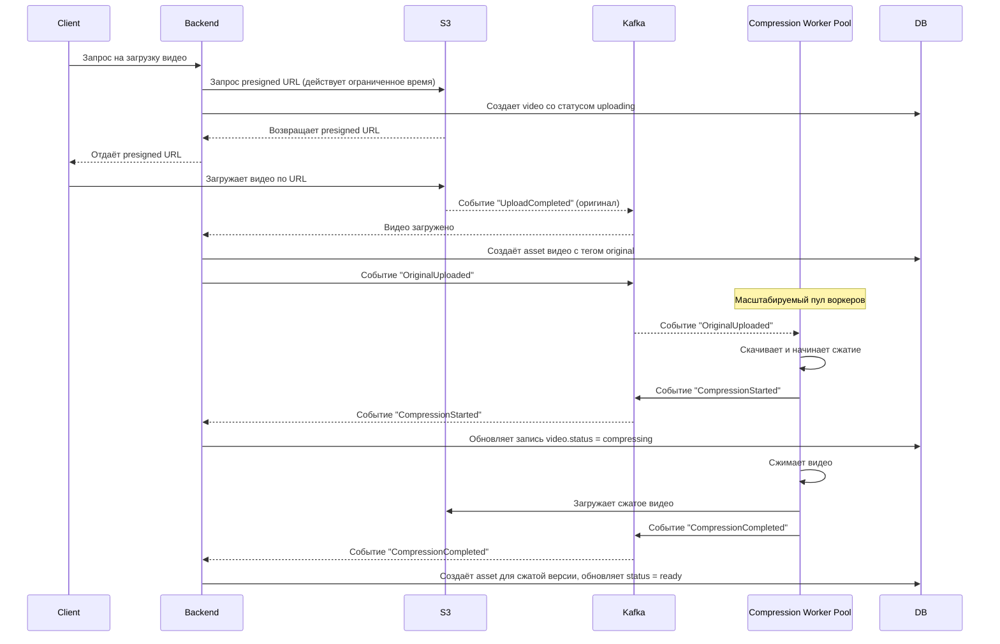
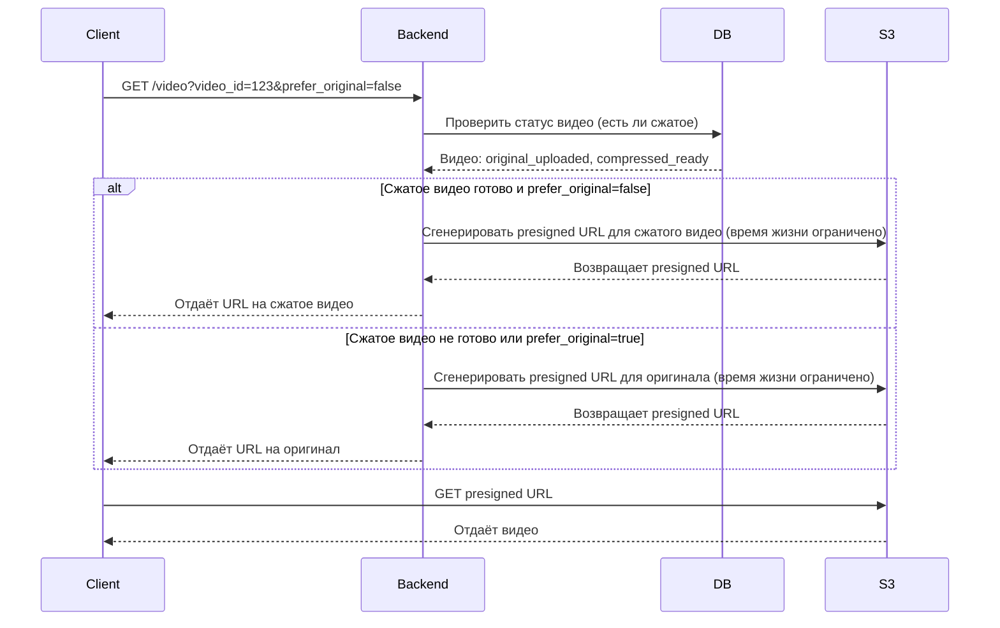

# Video Library Service (Internal)

Сервис для управления видео‑материалами организации для внутреннего использования.

---

# Core (MVP)
Базовый функционал, необходимый для запуска первой версии сервиса.

## Доступ и пользователи
- [x] Авторизованный доступ к системе
- [x] Роли пользователей
  - [x] Супер администратор
  - [x] Администратор
  - [x] Модератор
  - [x] Обычный пользователь
- [x] Назначение ролей пользователям (повышение до модератора или администратора)

## Группы пользователей 
- [ ] CRUD для групп пользователей
- [ ] Назначение модераторов на группы
- [ ] Управление группами доступно модераторам
- [ ] Создание групп доступно только модератору аккаунта

## Управление видео
- [ ] CRUD операции для видео
- [ ] Загрузка видео
- [ ] Хранение видео в S3‑совместимом хранилище
- [ ] Привязка видео к группам пользователей
- [ ] Просмотр видео пользователями с доступом

### Диаграммы последовательности 

## Загрузка видео



## Получение видео



### Заметки

* добавить тесты на работы с uint64 в postgres
* добавить везде проверку на выбранный account id в claims и фактический в url

### Возможности по статусам

#### Статусы аккаунтов

| Статус      | Возможности                                                                                                                                  |
|-------------|----------------------------------------------------------------------------------------------------------------------------------------------|
| Super Admin | Создаёт аккаунты, назначает/снимает любые роли, включая других админов; при передаче супер админа снижается до админа; все права наследуются |
| Admin       | Добавляет пользователей в аккаунт (статус по умолчанию user), назначает/снимает модераторов;                                                 |
| Moderator   | Создаёт и удаляет группы; добавляет пользователей в группы                                                                                   |
| User        | Только просмотр видео и доступных групп                                                                                                      |

#### Статусы внутри групп

| Статус группы | Возможности                                                                                      |
|---------------|--------------------------------------------------------------------------------------------------|
| Moderator     | Добавляет, изменяет и удаляет видео в группе; управляет составом группы (назначение модераторов) |
| User          | Просмотр видео в группе, добавление и удаление видео (только своих)                              |

> ⚠️ Все права наследуются сверху вниз: super admin > admin > moderator > user, но права в группах определяются отдельно и не автоматически наследуются от статуса аккаунта.
---

# Moderation / Extensions
Дополнительный функционал, который можно реализовать после MVP.

## Обработка видео
- [ ] Сжатие видео

## Модерация контента
- [ ] Заявка на добавление видео
- [ ] Проверка заявки модератором
- [ ] Принятие решения о публикации видео

## Уведомления
- [ ] Оповещения пользователей о добавлении новых видео

## AI функции
- [ ] Автоматическое создание тайм‑кодов для видео

---

## Генерация кода (bob)

Для генерации кода через **bob** необходимо создать конфигурационный файл `bobgen.yaml` в корне проекта.

Пример конфигурации (без конфиденциальных данных):

```yaml
psql:
  dsn: "postgres://<user>:<password>@<host>:<port>/<database>?sslmode=disable"
  driver: "github.com/jackc/pgx/v5/stdlib"
  schemas:
    - "app"
  uuid_pkg: "google"
  queries:
    - ./internal/repository

plugins:
  dbinfo:
    disabled: true
  enums:
    disabled: true
  models:
    disabled: false
    pkgname: "schema"
    destination: "./internal/gen/schema"
  factory:
    disabled: true
  dberrors:
    disabled: false
    pkgname: "dberrors"
    destination: "./internal/gen/dberrors"
  where:
    disabled: true
  loaders:
    disabled: true
  joins:
    disabled: true
```
