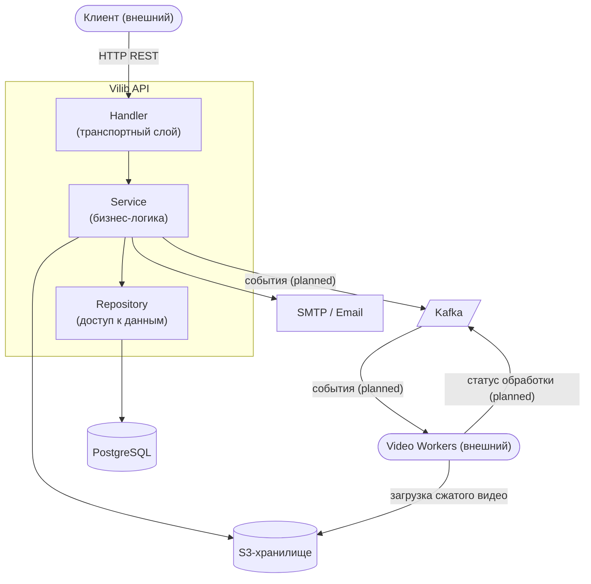
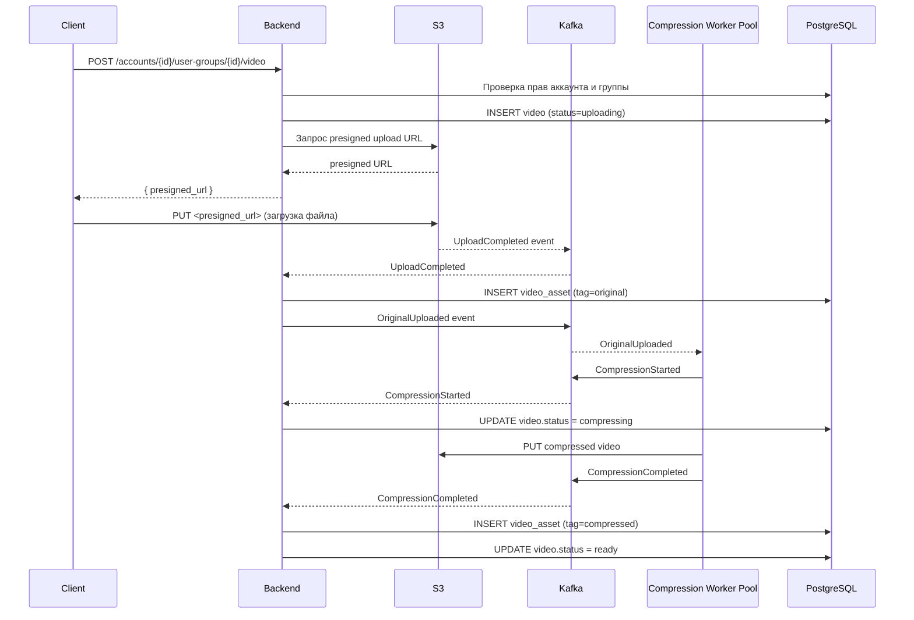
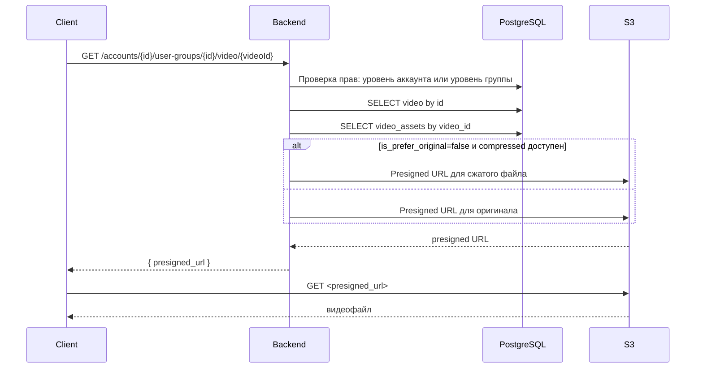
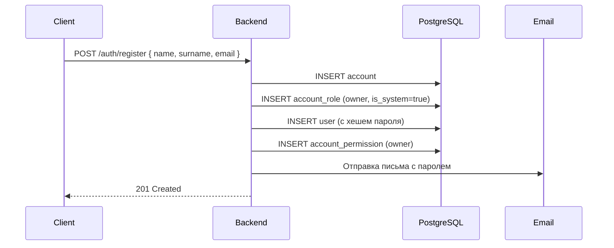

# Техническое задание на разработку Backend API  
## Vilib — сервис управления видеоконтентом для обучения персонала

**Версия:** 1.0  
**Статус:** Актуально

---

## Содержание

1. [Общие сведения](#1-общие-сведения)
2. [Назначение и цели системы](#2-назначение-и-цели-системы)
3. [Контекст и границы системы](#3-контекст-и-границы-системы)
4. [Пользователи системы](#4-пользователи-системы)
5. [Функциональные требования](#5-функциональные-требования)
6. [API — спецификация эндпоинтов](#6-api--спецификация-эндпоинтов)
7. [Модель данных](#7-модель-данных)
8. [Ролевая модель и права доступа](#8-ролевая-модель-и-права-доступа)
9. [Архитектура сервиса](#9-архитектура-сервиса)
10. [Диаграммы последовательностей](#10-диаграммы-последовательностей)
11. [Нефункциональные требования](#11-нефункциональные-требования)
12. [Стек технологий](#12-стек-технологий)
13. [Конфигурация и среда выполнения](#13-конфигурация-и-среда-выполнения)

---

## 1. Общие сведения

| Поле                    | Значение                      |
|-------------------------|-------------------------------|
| Название проекта        | Vilib — Video Library Service |
| Тип системы             | REST API (бэкенд-сервис)      |
| Язык реализации         | Go 1.25                       |
| База данных             | PostgreSQL (схема `app`)      |
| Объектное хранилище     | S3-совместимое хранилище      |
| Протокол                | HTTP/1.1, JSON                |
| Формат документации API | OpenAPI 3.0 (Swagger)         |
| Репозиторий             | `vilib-api`                   |

---

## 2. Назначение и цели системы

**Vilib** — это внутренний сервис организации для хранения, структурирования и предоставления доступа к видеоматериалам, используемым в процессе обучения персонала.

### Цели

- Централизованное хранение учебных видеоматериалов с разграничением доступа по группам сотрудников.
- Управление пользователями внутри организации (аккаунта) с гибкой ролевой моделью.
- Безопасная загрузка и стриминг видео через S3-совместимое хранилище с использованием presigned URL.
- Поддержка нескольких организаций (аккаунтов) в рамках единого сервиса.
- Масштабируемая обработка видео (сжатие) через очередь событий.

---

## 3. Контекст и границы системы



**Внешние зависимости:**

| Компонент     | Роль                                             | Статус        |
|---------------|--------------------------------------------------|---------------|
| PostgreSQL    | Основное хранилище метаданных                    | Реализовано   |
| S3            | Хранение видеофайлов, генерация presigned URL    | Реализовано   |
| Kafka         | Очередь событий для обработки видео              | Запланировано |
| SMTP / Email  | Уведомления пользователей (пароль при создании)  | Реализовано   |
| Video Workers | Асинхронная обработка и сжатие видео             | Запланировано |

---

## 4. Пользователи системы

Система работает в контексте **аккаунта** (организации). Один пользователь может принадлежать нескольким аккаунтам с разными ролями в каждом.

Предустановленных ролей в системе нет. Каждая роль создаётся администратором аккаунта вручную и настраивается индивидуально через битовую маску разрешений. Единственным исключением является системная роль владельца аккаунта (`is_system = true`), которая создаётся автоматически при регистрации.

В каждом аккаунте и каждой группе должна быть назначена роль по умолчанию (`is_default = true`) — она присваивается новым пользователям и участникам группы автоматически при добавлении.

Пользователь может иметь разные роли в разных группах внутри одного аккаунта. Права на уровне группы настраиваются независимо от прав на уровне аккаунта.

---

## 5. Функциональные требования

### 5.1 Аутентификация и авторизация

| ID   | Требование                                                                                 |
|------|--------------------------------------------------------------------------------------------|
| A-01 | Система должна поддерживать регистрацию нового аккаунта через email и пароль               |
| A-02 | Система должна выдавать JWT-токен при успешной аутентификации                              |
| A-03 | JWT-токен должен содержать: `user_id`, `current_account_id`, список `accounts`             |
| A-04 | Все защищённые эндпоинты должны требовать валидный JWT в заголовке `Authorization: Bearer` |
| A-05 | `account_id` в URL должен соответствовать `current_account_id` из JWT-токена               |
| A-06 | При превышении прав доступа возвращается HTTP 403                                          |

### 5.2 Управление пользователями

| ID   | Требование                                                                             |
|------|----------------------------------------------------------------------------------------|
| U-01 | Пользователь с правом `ManageUsers` должен иметь возможность создать нового пользователя в аккаунте |
| U-02 | При создании пользователя ему должен быть отправлен email с паролем                    |
| U-03 | Пользователь с правом `ManageUsers` должен иметь возможность изменить роль пользователя в аккаунте |
| U-04 | Должен быть доступен список пользователей аккаунта (требует право `ManageUsers`)       |

### 5.3 Управление группами

| ID   | Требование                                                                             |
|------|----------------------------------------------------------------------------------------|
| G-01 | Пользователь с правом `ManageGroups` должен иметь возможность создать группу пользователей |
| G-02 | Пользователь с правом `ManageGroups` должен иметь возможность удалить группу          |
| G-03 | Пользователь с правом `ManageMembers` (группа) должен иметь возможность добавлять участников |
| G-04 | Пользователь с правом `ManageMembers` (группа) должен иметь возможность удалять участников |
| G-05 | Должен быть доступен список групп аккаунта                                             |

### 5.4 Управление ролями

| ID   | Требование                                                                             |
|------|----------------------------------------------------------------------------------------|
| R-01 | Пользователь с правом `ManageAccountRoles` должен иметь возможность создавать роли аккаунта |
| R-02 | Роли аккаунта должны поддерживать наследование через `parent_role_id`                  |
| R-03 | Пользователь с соответствующим правом должен иметь возможность создавать роли группы  |
| R-04 | В каждом аккаунте должна быть системная роль владельца (`is_system = true`)            |
| R-05 | В каждом аккаунте и каждой группе должна быть роль по умолчанию (`is_default = true`) |

### 5.5 Управление видео

| ID   | Требование                                                                             |
|------|----------------------------------------------------------------------------------------|
| V-01 | Пользователь с правом `ManageVideo` должен получить presigned URL для загрузки видео в S3 |
| V-02 | После запроса на загрузку видео должно получить статус `uploading`                     |
| V-03 | Пользователь с правом `VideoWatch` должен получить presigned URL для стриминга видео  |
| V-04 | При получении URL системе предпочтительна сжатая версия, если она доступна            |
| V-05 | Пользователь с правом `VideoWatch` должен иметь возможность получить список видео группы |
| V-06 | Пользователь с правом `ManageVideo` должен иметь возможность переименовать видео      |
| V-07 | Пользователь с правом `ManageVideo` должен иметь возможность удалить видео            |
| V-08 | Видео должно быть привязано к группе и иметь автора                                   |

### 5.6 Обработка видео (запланировано)

| ID   | Требование                                                                             |
|------|----------------------------------------------------------------------------------------|
| P-01 | После успешной загрузки оригинала в S3 должно создаваться событие `UploadCompleted`   |
| P-02 | Воркер сжатия должен получать события через Kafka и обрабатывать видео асинхронно     |
| P-03 | После сжатия должен создаваться asset с тегом `compressed`                            |
| P-04 | Статус видео должен обновляться: `uploading` → `compressing` → `ready`                |

---

## 6. API — спецификация эндпоинтов

**Base URL:** `/api/v1`  
**Формат:** `application/json`  
**Аутентификация:** `Authorization: Bearer <token>` (кроме auth-эндпоинтов)

---

### 6.1 Аутентификация

| Метод | URL             | Описание                                       | Права    | Ошибки           |
|-------|-----------------|------------------------------------------------|----------|------------------|
| POST  | `/auth/register` | Регистрация нового пользователя и создание аккаунта | —   | 400, 409, 500    |
| POST  | `/auth/login`   | Аутентификация, возвращает JWT-токен           | —        | 400, 401, 500    |

---

### 6.2 Пользователи

| Метод | URL                          | Описание                              | Права              | Ошибки              |
|-------|------------------------------|---------------------------------------|--------------------|---------------------|
| POST  | `/accounts/{accountId}/users` | Создание пользователя в аккаунте. Email с паролем отправляется автоматически | `ManageUsers` | 400, 401, 403, 409, 500 |
| PUT   | `/users/{userId}`             | Изменение роли пользователя в аккаунте | `ManageUsers`   | 400, 401, 403, 404, 500 |
| GET   | `/accounts/{accountId}/users` *(новый)* | Список пользователей аккаунта | `ManageUsers` | 400, 401, 403, 500 |

---

### 6.3 Роли аккаунта

| Метод | URL                           | Описание                                           | Права                  | Ошибки              |
|-------|-------------------------------|----------------------------------------------------|------------------------|---------------------|
| POST  | `/accounts/{accountId}/roles` | Создание новой роли аккаунта с битовой маской прав | `ManageAccountRoles`   | 400, 401, 403, 409, 500 |

---

### 6.4 Группы пользователей

| Метод  | URL                                                          | Описание                          | Права                            | Ошибки              |
|--------|--------------------------------------------------------------|-----------------------------------|----------------------------------|---------------------|
| POST   | `/accounts/{accountId}/user-groups`                          | Создание группы пользователей     | `ManageGroups`                   | 400, 401, 403, 409, 500 |
| GET    | `/accounts/{accountId}/user-groups` *(новый)*                | Список групп аккаунта             | Аутентификация                   | 400, 401, 403, 500  |
| POST   | `/accounts/{accountId}/user-groups/{groupId}/members`        | Добавление пользователей в группу | `ManageMembers` (группа)         | 400, 401, 403, 409, 500 |
| DELETE | `/accounts/{accountId}/user-groups/{groupId}/members/{userId}` *(новый)* | Удаление пользователя из группы | `ManageMembers` (группа) | 400, 401, 403, 404, 500 |

---

### 6.5 Роли групп

| Метод | URL                                          | Описание                                    | Права          | Ошибки              |
|-------|----------------------------------------------|---------------------------------------------|----------------|---------------------|
| POST  | `/accounts/{accountId}/user-groups/roles`    | Создание роли группы с битовой маской прав  | `ManageGroups` | 400, 401, 403, 409, 500 |

---

### 6.6 Видео

| Метод  | URL                                                                  | Описание                                                                 | Права                       | Ошибки              |
|--------|----------------------------------------------------------------------|--------------------------------------------------------------------------|-----------------------------|---------------------|
| POST   | `/accounts/{accountId}/user-groups/{groupId}/video`                  | Запрос presigned URL для загрузки видео в S3                             | `ManageVideo` (оба уровня)  | 400, 401, 403, 500  |
| GET    | `/accounts/{accountId}/user-groups/{groupId}/video/{videoId}`        | Получение presigned URL для стриминга. Query: `is_prefer_original=bool`  | `VideoWatch` + членство     | 400, 401, 403, 404, 500 |
| GET    | `/accounts/{accountId}/user-groups/{groupId}/videos` *(новый)*       | Список видео группы с метаданными                                        | `VideoWatch` + членство     | 400, 401, 403, 500  |
| PUT    | `/accounts/{accountId}/user-groups/{groupId}/video/{videoId}` *(новый)* | Переименование видео                                                  | `ManageVideo` (группа)      | 400, 401, 403, 404, 409, 500 |
| DELETE | `/accounts/{accountId}/user-groups/{groupId}/video/{videoId}` *(новый)* | Удаление видео и связанных ассетов                                    | `ManageVideo` (группа)      | 400, 401, 403, 404, 500 |

---

## 7. Модель данных

### Таблица `app.accounts`

| Поле        | Тип       | Ограничения         | Описание                     |
|-------------|-----------|---------------------|------------------------------|
| account_id  | uuid      | PK, default gen     | Идентификатор аккаунта       |
| name        | varchar   | UNIQUE NOT NULL     | Название аккаунта            |
| owner_id    | uuid      | NOT NULL            | Идентификатор пользователя-владельца |
| email       | varchar   | NOT NULL            | Контактный email аккаунта    |
| created_at  | timestamp | NOT NULL, default now | Дата создания              |

### Таблица `app.users`

| Поле          | Тип       | Ограничения           | Описание                          |
|---------------|-----------|-----------------------|-----------------------------------|
| user_id       | uuid      | PK, default gen       | Идентификатор пользователя        |
| name          | varchar   | NOT NULL              | Имя пользователя                  |
| surname       | varchar   | NOT NULL              | Фамилия пользователя              |
| password_hash | varchar   | NOT NULL              | Bcrypt-хеш пароля                 |
| email         | varchar   | NOT NULL              | Email пользователя                |
| role_id       | uuid      | FK → account_roles    | Роль пользователя в аккаунте      |
| created_at    | timestamp | NOT NULL, default now | Дата создания                     |

### Таблица `app.account_roles`

| Поле            | Тип     | Ограничения                         | Описание                                  |
|-----------------|---------|-------------------------------------|-------------------------------------------|
| account_role_id | uuid    | PK, default gen                     | Идентификатор роли                        |
| name            | varchar | NOT NULL                            | Название роли                             |
| account_id      | uuid    | FK → accounts, NOT NULL             | Аккаунт, которому принадлежит роль        |
| permission_mask | bigint  | NOT NULL                            | 64-битная маска прав                      |
| parent_role_id  | uuid    | FK → account_roles, nullable        | Родительская роль для наследования        |
| is_system       | bool    | NOT NULL                            | Системная роль (недоступна для удаления)  |
| is_default      | bool    | NOT NULL                            | Роль по умолчанию для новых пользователей |
| —               | —       | UNIQUE(account_id, name)            | —                                         |

### Таблица `app.user_groups`

| Поле       | Тип     | Ограничения              | Описание                        |
|------------|---------|--------------------------|---------------------------------|
| group_id   | uuid    | PK, default gen          | Идентификатор группы            |
| name       | varchar | NOT NULL                 | Название группы                 |
| account_id | uuid    | FK → accounts, NOT NULL  | Аккаунт, которому принадлежит группа |
| —          | —       | UNIQUE(name, account_id) | —                               |

### Таблица `app.group_roles`

| Поле          | Тип     | Ограничения               | Описание                                |
|---------------|---------|---------------------------|-----------------------------------------|
| group_role_id | uuid    | PK, default gen           | Идентификатор роли группы               |
| name          | varchar | NOT NULL                  | Название роли                           |
| permissions   | bigint  | NOT NULL                  | 64-битная маска прав группы             |
| account_id    | uuid    | FK → accounts, NOT NULL   | Аккаунт, к которому относится роль      |
| is_default    | bool    | NOT NULL                  | Роль по умолчанию для новых участников  |
| —             | —       | UNIQUE(account_id, name)  | —                                       |

### Таблица `app.group_members`

| Поле     | Тип  | Ограничения                        | Описание                           |
|----------|------|------------------------------------|-------------------------------------|
| user_id  | uuid | FK → users, PK                     | Идентификатор пользователя          |
| group_id | uuid | FK → user_groups, PK               | Идентификатор группы                |
| role_id  | uuid | FK → group_roles, NOT NULL         | Роль пользователя в данной группе   |
| —        | —    | PRIMARY KEY(user_id, group_id)     | —                                   |

### Таблица `app.user_group_videos`

| Поле          | Тип       | Ограничения                   | Описание                               |
|---------------|-----------|-------------------------------|----------------------------------------|
| id            | uuid      | PK, default gen               | Идентификатор видео                    |
| user_group_id | uuid      | FK → user_groups, NOT NULL    | Группа, которой принадлежит видео      |
| name          | varchar   | NOT NULL                      | Название видео                         |
| author        | uuid      | FK → users, NOT NULL          | Пользователь, загрузивший видео        |
| status        | int       | NOT NULL                      | Статус видео (см. таблицу статусов)    |
| created_at    | timestamp | NOT NULL, default now         | Дата создания                          |
| —             | —         | UNIQUE(user_group_id, name)   | —                                      |

### Таблица `app.files`

| Поле         | Тип       | Ограничения           | Описание                         |
|--------------|-----------|-----------------------|----------------------------------|
| file_id      | uuid      | PK, default gen       | Идентификатор файла              |
| bucket_name  | varchar   | NOT NULL              | Имя S3-бакета                    |
| object_key   | varchar   | NOT NULL              | Ключ объекта в S3                |
| content_type | varchar   | NOT NULL              | MIME-тип файла                   |
| size_bytes   | bigint    | NOT NULL              | Размер файла в байтах            |
| created_at   | timestamp | NOT NULL, default now | Дата создания                    |

### Таблица `app.video_assets`

| Поле       | Тип       | Ограничения                 | Описание                                    |
|------------|-----------|-----------------------------|---------------------------------------------|
| file_id    | uuid      | PK, FK → files              | Идентификатор файла                         |
| video_id   | uuid      | FK → user_group_videos, NOT NULL | Видео, которому принадлежит ассет       |
| tag        | int       | NOT NULL                    | Тип ассета: 0 — оригинал, 1 — сжатое видео |
| created_at | timestamp | NOT NULL, default now       | Дата создания                               |

### Статусы видео

| Значение | Название          | Описание                              |
|----------|-------------------|---------------------------------------|
| `0`      | `uploading`       | Видео ожидает загрузки клиентом в S3  |
| `1`      | `compressing`     | Видео передано воркеру для сжатия     |
| `2`      | `ready`           | Видео готово к просмотру              |

---

## 8. Ролевая модель и права доступа

Права хранятся в виде **64-битной битовой маски** (`int64`). Каждый бит соответствует одному праву. Позиция бита — `0-based`. Права делятся на два типа:

- **ReadWrite** — операции создания и удаления сущности (и сопутствующие: редактирование, список).
- **Readonly** — операции только на чтение/просмотр.

### 8.1 Права на уровне аккаунта (`account_roles.permission_mask`)

Права уровня аккаунта распространяются на **все группы** внутри аккаунта.

| Константа                        | Бит | Тип       | Описание                                                        |
|----------------------------------|-----|-----------|-----------------------------------------------------------------|
| `AccountPermissionOwner`         | `0` | —         | Владелец аккаунта; обходит все проверки прав                    |
| `AccountPermissionManageUsers`   | `1` | ReadWrite | Создание, редактирование и удаление пользователей в аккаунте    |
| `AccountPermissionManageRoles`   | `2` | ReadWrite | Создание и удаление ролей аккаунта                              |
| `AccountPermissionManageGroups`  | `3` | ReadWrite | Создание и удаление групп пользователей                         |
| `AccountPermissionVideoWatch`    | `4` | Readonly  | Просмотр видео во всех группах аккаунта                         |
| `AccountPermissionManageVideo`   | `5` | ReadWrite | Загрузка, редактирование и удаление видео во всех группах       |

### 8.2 Права на уровне группы (`group_roles.permissions`)

Права уровня группы действуют только **внутри конкретной группы**. Один и тот же пользователь может иметь разные права в разных группах.

| Константа                      | Бит | Тип       | Описание                                               |
|--------------------------------|-----|-----------|--------------------------------------------------------|
| `GroupPermissionOwner`         | `0` | —         | Владелец группы; обходит все проверки прав группы      |
| `GroupPermissionManageMembers` | `1` | ReadWrite | Добавление и удаление участников группы                |
| `GroupPermissionVideoWatch`    | `2` | Readonly  | Просмотр видео в группе                                |
| `GroupPermissionManageVideo`   | `3` | ReadWrite | Загрузка, редактирование и удаление видео в группе     |

### 8.3 Логика проверки прав

**Общие правила:**

1. Если пользователь имеет бит `Owner` (бит 0) на соответствующем уровне — разрешено всё без дальнейших проверок.
2. Для операций с видео проверяются оба уровня: сначала уровень аккаунта, затем уровень группы.

**Проверка при работе с видео:**

Права на видео на уровне аккаунта и на уровне группы отличаются областью применения:
- `AccountPermissionVideoWatch` / `AccountPermissionManageVideo` — применяются ко всем группам аккаунта.
- `GroupPermissionVideoWatch` / `GroupPermissionManageVideo` — применяются только к конкретной группе.

При проверке доступа к видео используется следующая логика:

- Если у пользователя есть соответствующее право на уровне аккаунта — доступ разрешён без проверки группы.
- Если права на уровне аккаунта нет — выполняется проверка комбинации: **пользователь × запрашиваемая группа × право группы**. Доступ разрешается, если пользователь является участником группы и его роль в этой группе содержит нужный бит.

---

## 9. Архитектура сервиса

Проект использует стандартную **трёхслойную архитектуру**:

```
Handler (транспортный слой)
    └── Service (слой бизнес-логики)
            └── Repository (слой доступа к данным)
```

### Слои

| Слой       | Пакет                 | Ответственность                                        |
|------------|-----------------------|--------------------------------------------------------|
| Handler    | `internal/handler`    | Парсинг запроса, вызов сервисов, формирование ответа   |
| Service    | `internal/service`    | Бизнес-логика, проверка прав, оркестрация репозиториев |
| Repository | `internal/repository` | Запросы к PostgreSQL через bob ORM                     |

### Вспомогательные пакеты

| Пакет             | Ответственность                                              |
|-------------------|--------------------------------------------------------------|
| `internal/domain` | Бизнес-сущности, константы, операции с битовыми масками      |
| `internal/dto`    | Структуры запросов и ответов HTTP API                        |
| `internal/s3`     | Интеграция с S3-совместимым хранилищем                       |
| `internal/saga`   | Управление транзакциями и жизненным циклом запроса           |

### Паттерн Saga

Каждый handler оборачивает бизнес-логику в `saga.Run()`. Это обеспечивает единую точку управления транзакцией БД, передачу зависимостей в виде `*service.Service` и консистентный способ возврата ошибок к handler'у.

---

## 10. Диаграммы последовательностей

### 10.1 Загрузка видео



### 10.2 Получение видео



### 10.3 Регистрация и создание аккаунта



---

## 11. Нефункциональные требования

### Безопасность

| ID   | Требование                                                                        |
|------|-----------------------------------------------------------------------------------|
| S-01 | Пароли хранятся только в виде bcrypt-хеша                                         |
| S-02 | JWT-токен подписывается симметричным ключом, хранящимся в конфигурации            |
| S-03 | Время жизни JWT — 24 часа                                                         |
| S-04 | Presigned URL для загрузки действителен 1 час, для просмотра — 1 час             |
| S-05 | `account_id` в URL запроса должен совпадать с `current_account_id` в JWT         |
| S-06 | Внутренние ошибки сервера не раскрывают детали реализации в ответе клиенту (500) |

### Надёжность

| ID   | Требование                                                                         |
|------|------------------------------------------------------------------------------------|
| R-01 | Создание пользователя и аккаунта должно выполняться в одной транзакции БД          |
| R-02 | При ошибке на любом шаге транзакция должна откатываться                            |
| R-03 | Сервис должен корректно завершать работу при получении сигнала ОС (graceful shutdown) |

### Наблюдаемость

| ID   | Требование                                                          |
|------|---------------------------------------------------------------------|
| O-01 | Все ошибки должны логироваться                                      |
| O-02 | API должен быть задокументирован в Swagger (OpenAPI 3.0)            |
| O-03 | Swagger UI доступен по `/api/swagger/*`                             |

### Тестируемость

| ID   | Требование                                                                      |
|------|---------------------------------------------------------------------------------|
| T-01 | Все интерфейсы service и repository должны иметь mock-реализации                |
| T-02 | Handler-тесты не должны обращаться к реальной БД (используются моки)            |
| T-03 | Service-тесты должны быть table-driven и поддерживать параллельное выполнение   |
| T-04 | Integration-тесты repository используют изолированные контейнеры с PostgreSQL   |

---

## 12. Стек технологий

| Категория            | Технология                                    | Версия  |
|----------------------|-----------------------------------------------|---------|
| Язык                 | Go                                            | 1.25    |
| HTTP-фреймворк       | github.com/gin-gonic/gin                      | 1.12.0  |
| БД-драйвер           | github.com/jackc/pgx/v5                       | 5.8.0   |
| ORM / Query builder  | github.com/stephenafamo/bob                   | 0.42.0  |
| Миграции             | github.com/pressly/goose/v3                   | 3.27.0  |
| JWT                  | github.com/golang-jwt/jwt/v5                  | 5.3.1   |
| Хеширование паролей  | golang.org/x/crypto (bcrypt)                  | 0.49.0  |
| UUID                 | github.com/google/uuid                        | 1.6.0   |
| Логирование          | go.uber.org/zap                               | 1.27.1  |
| Конфигурация         | github.com/spf13/viper                        | 1.21.0  |
| Документация API     | github.com/swaggo/swag                        | 1.16.6  |
| Тесты (assertions)   | github.com/stretchr/testify                   | 1.11.1  |
| Тесты (моки)         | github.com/gojuno/minimock/v3                 | 3.4.7   |
| Тесты (контейнеры)   | github.com/testcontainers/testcontainers-go   | 0.38.0  |
| Faker (тест. данные) | github.com/jaswdr/faker/v2                    | 2.9.1   |

---

## 13. Конфигурация и среда выполнения

Конфигурация задаётся через `config/config.yaml` и переопределяется переменными среды.

### Параметры конфигурации

| Секция     | Параметр     | Описание                            |
|------------|--------------|-------------------------------------|
| `server`   | `port`       | Порт HTTP-сервера (default: 8080)   |
| `server`   | `mode`       | Режим: `development` / `production` |
| `database` | `dsn`        | DSN-строка подключения к PostgreSQL |
| `auth`     | `key`        | Секретный ключ для подписи JWT      |
| `auth`     | `expire`     | Время жизни токена (default: 24h)   |
| `email`    | `host`       | SMTP-хост                           |
| `email`    | `port`       | SMTP-порт                           |
| `s3`       | `endpoint`   | URL S3-совместимого хранилища       |
| `s3`       | `bucket`     | Имя бакета                          |
| `s3`       | `access_key` | Access key                          |
| `s3`       | `secret_key` | Secret key                          |

### Режимы запуска

| Режим         | Поведение                                                          |
|---------------|--------------------------------------------------------------------|
| `development` | Email отправляется в локальный mailbox-канал (без SMTP), Gin debug |
| `production`  | Email через SMTP, Gin release mode, без stack trace в логах        |
