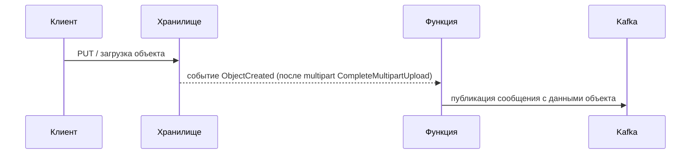

# Краткое резюме 

Изученные S3/S3‑совместимые сервисы хранилища в России демонстрируют следующие возможности: 
Яндекс.Object Storage поддерживает события создания объектов (ObjectCreated) и подписанные 
URL для закачки и скачивания (до 30 дней)【9†L168-L171】【23†L125-L134】, но отправка событий 
в Kafka нативно не предусмотрена (обычно используют триггеры функций для дальнейшей обработки). 
Selectel Object Storage **не поддерживает** нотификации (Bucket Notification)【33†L102-L110】, 
т.е. нет событий upload-complete, и соответственно нет готовой интеграции с Kafka; однако 
он совместим с AWS S3 API и позволяет генерировать presigned URL (через CLI/SDK), например 
`aws s3 presign` по умолчанию выдаёт ссылку на 1 час【31†L366-L370】. Облачное S3 от Cloud4Y 
(на базе Cloudian HyperStore) согласно обзору CNews не имеет поддержки S3-событий 
(Bucket Notification)【49†L815-L823】; явная поддержка подписанных URL у них не описана 
(таблица CNews указывает «Нет» по этому пункту). Самостоятельно разворачиваемый MinIO 
поддерживает Bucket Notification (включая события `ObjectCreated:Put` и `CompleteMultipartUpload`) 
и умеет публиковать эти события в Kafka (через встроенный адаптер)【86†L528-L536】; 
presigned URL для загрузки и скачивания также поддерживаются (максимальная длительность ~7 дней, 
как и в S3). Система ЗАКРОМА.Хранение не поддерживает S3 Bucket Notification (ни старая, ни новая версия API)
【74†L109-L112】, то есть событий об окончании загрузки нет; интеграция с Kafka есть на уровне системного конфига, 
но не через событие загрузки. Она поддерживает presigned URL (в CLI есть команды `presign upload/download`) 
c настраиваемым сроком, но явных ограничений по сроку в документации не указано.

Ниже представлена сравнительная таблица по функциональности. Для наглядности также приведён пример маршрутизации 
события загрузки в Kafka через облачный триггер (Mermaid-диаграмма).

| Провайдер / Свойство        | Событие загрузки (upload complete)                                                               | Пересылка событий в Kafka                                                  | Presigned URL загрузка (PUT/POST)                                           | Presigned URL скачивание (GET)                                                              | Примечания/ссылки                                                                                                                                                             |
|-----------------------------|--------------------------------------------------------------------------------------------------|----------------------------------------------------------------------------|-----------------------------------------------------------------------------|---------------------------------------------------------------------------------------------|-------------------------------------------------------------------------------------------------------------------------------------------------------------------------------|
| **Yandex Object Storage**   | Да – поддерживает события S3 (`ObjectCreated:Put` и т.п.)【9†L168-L171】                           | Нет напрямую (обычно через Cloud Function; прямой Kafka-интеграции нет)    | Да (через API/CLI `yc storage s3 presign`)【20†L160-L169】                    | Да, cрок до 30 дней【18†L7-L9】【23†L125-L134】                                                 | События можно обрабатывать через триггеры Functions. Ограничение срока подписанной ссылки – 30 дней【18†L7-L9】.                                                                |
| **Selectel Object Storage** | Нет – Bucket Notification не поддерживается【33†L102-L110】                                        | Нет (нет событий S3, поэтому пересылка невозможна)                         | Да (AWS SigV4, например `aws s3 presign`; по умолчанию 1 час【31†L366-L370】) | Да (через presign; по умолчанию 1 час; не указано ограничение, вероятно до 7 дней как в S3) | Поддерживает AWS S3 API; подписанные ссылки работают, но явных лимитов в документации нет. Нет поддержки уведомлений.                                                         |
| **Cloud4Y (Cloudian)**      | Согласно обзору CNews – **нет** поддержки S3-событий【49†L815-L823】                               | Нет (нет внутренних нотификаций; возможно через коннекторы вручную)        | Предположительно да (S3-совместим; но официальных данных нет)               | Предположительно да (аналогично S3)                                                         | Информации в открытых источниках мало. CNews указывает отсутствие уведомлений【49†L815-L823】. Требуется проверка на практике (API-вызов `GetBucketNotificationConfiguration`). |
| **MinIO (self-hosted)**     | Да – поддерживает Bucket Notifications (`s3:ObjectCreated:Put`, `CompleteMultipartUpload`, etc.) | Да – встроенные нотификации могут отправлять события в Kafka【86†L528-L536】 | Да (AWS SigV4; SDK `GetPresignedObjectUrl`; по умолчанию 7 дней)            | Да (до 7 дней максимум, как по спецификации S3)                                             | Полная совместимость S3. Настройка Kafka через переменные среды `MINIO_NOTIFY_KAFKA_*`. Пример интеграции – документация MinIO AIStor【86†L528-L536】.                          |
| **ЗАКРОМА.Хранение**        | Нет – API уведомлений не поддерживается (ни уст. ни новая)【74†L109-L112】                         | Нет (хотя есть Kafka-клиент, события загрузки не генерируются)             | Да (CLI `zcli presign upload`), лимитов нет в документации                  | Да (CLI `zcli presign download`), лимитов нет в документации                                | Совместимо с S3 API (поддерживает PUT/GET и мультипарт【74†L53-L60】【75†L1-L4】). Нотификации не поддерживаются【74†L109-L112】, Kafka-интеграция реализуется отдельно в конфиге.  |

**Источники и ссылки:** официальная документация провайдеров и обзоры (см. примечания в таблице): Yandex Cloud Storage【9†L168-L171】【18†L7-L9】【23†L125-L134】, Selectel S3 API【33†L102-L110】【31†L366-L370】, аналитика CNews【49†L815-L823】, MinIO AIStor Docs【86†L528-L536】, Zakroma Docs【74†L109-L112】【75†L1-L4】.  

